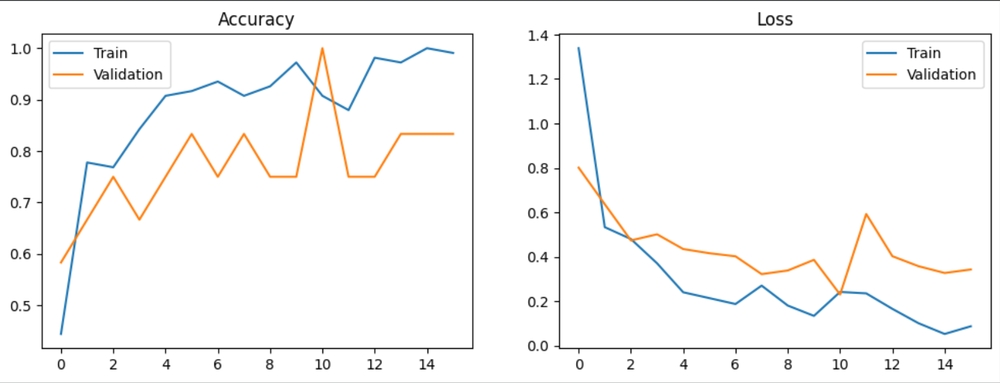

# 🌾 Rice Leaf Disease Classification using Deep Learning

A deep learning project that classifies rice leaf diseases from leaf images using **Transfer Learning** with **MobileNetV2** and **TensorFlow/Keras**.

The model can identify three common rice diseases from images and demonstrates how transfer learning can achieve high accuracy even on relatively small datasets.

---

## 📌 Problem Statement

Rice crops are susceptible to several diseases that reduce yield and quality. Early identification helps farmers take timely preventive measures.

This project aims to automatically classify rice leaf images into disease categories using a lightweight CNN model suitable for deployment on resource-constrained devices.

---

## 🚀 Features

- Image classification using Deep Learning
- Transfer Learning with MobileNetV2
- Data Augmentation
- Early Stopping
- Learning Rate Scheduling
- TensorFlow Dataset Pipeline
- Validation Accuracy of **100%** on the provided validation split

---

## 🗂 Dataset

Dataset:
**Rice Leaf Diseases Dataset**

Classes:

- 🌿 Brown Spot
- 🌿 Bacterial Leaf Blight
- 🌿 Leaf Smut

Total Images:
- 120 Images
- 3 Classes
- 40 Images per Class

---

## 🛠 Tech Stack

- Python
- TensorFlow
- Keras
- MobileNetV2
- NumPy
- Pandas
- Matplotlib
- Pillow

---

## 🧠 Model Architecture

Input Image (224 × 224)

↓

Data Augmentation
- Random Flip
- Random Rotation
- Random Zoom

↓

MobileNetV2 (ImageNet Pretrained)

↓

Global Average Pooling

↓

Dense Layer (64)

↓

Dropout (0.4)

↓

Softmax Output Layer (3 Classes)

---

## ⚙️ Training Configuration

| Parameter | Value |
|-----------|-------|
| Image Size | 224×224 |
| Batch Size | 4 |
| Optimizer | AdamW |
| Learning Rate | 0.001 |
| Loss Function | Categorical Crossentropy |
| Epochs | 30 (Early Stopping Applied) |
| Validation Split | 10% |

---

## 📊 Results

| Metric | Score |
|---------|-------|
| Validation Accuracy | **100%** |
| Validation Loss | **0.2303** |

> **Note:** The dataset contains only 120 images. While the validation accuracy is excellent, a larger and more diverse dataset would be required to evaluate real-world performance.

---

## 📈 Training Curves

(Add your accuracy/loss graph here)

```
images/
    training_curve.png
```

```markdown

```

---

## 📂 Project Structure

```
Rice-Leaf-Disease-Classification/
│
├── notebook.ipynb
├── README.md
├── requirements.txt
├── images/
│   └── training_curve.png
└── models/
```

---

## 🔮 Future Improvements

- Fine-tune the MobileNetV2 backbone
- Increase dataset size
- Perform K-Fold Cross Validation
- Deploy as a web application using Streamlit or FastAPI
- Convert model to TensorFlow Lite for mobile deployment
- Add Grad-CAM visualizations for explainability

---

## 📚 Learning Outcomes

Through this project I learned:

- Transfer Learning
- Image Classification
- TensorFlow Dataset API
- Data Augmentation
- CNN Model Training
- Early Stopping & LR Scheduling
- Performance Evaluation

---

## 👨‍💻 Author

**Pranav Landge**

If you have suggestions or improvements, feel free to open an issue or connect with me.
